# Prompt 编写模式：如何将思维框架赋予机器

ChatGPT Simple Cheatsheet


Download: [pdf](cheatsheet/prompt-simple-cheatsheet.pdf), [pptx](cheatsheet/prompt-simple-cheatsheet.pptx)

如何理解 Prompt ？

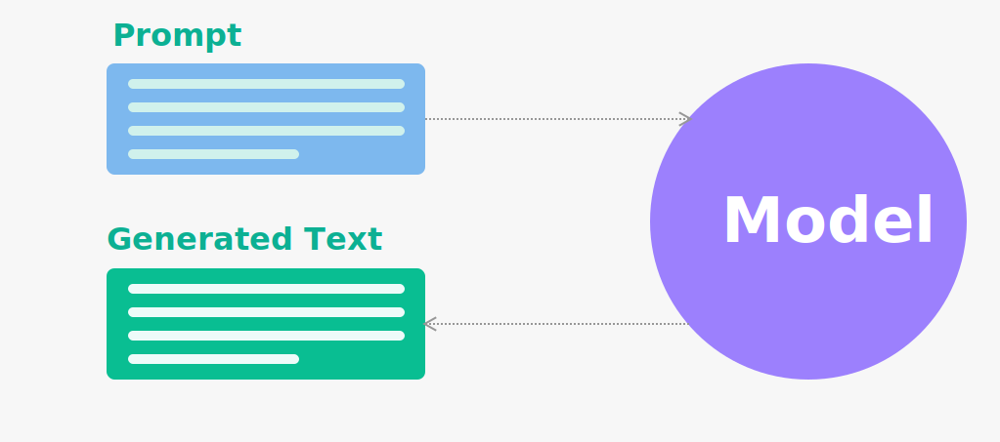

> prompt 通常指的是一个输入的文本段落或短语，作为生成模型输出的起点或引导。prompt 可以是一个问题、一段文字描述、一段对话或任何形式的文本输入，模型会基于 prompt 所提供的上下文和语义信息，生成相应的输出文本。

举个例子，对于一个语言模型，prompt 可以是 "The cat sat on the"，模型可以通过对接下来的词语进行预测，生成类似于 "mat"、"chair"、"sofa" 等不同的输出：


上图为 Stable Diffusion 生成 (Prompt: The cat sat on the , Steps: 30, Sampler: Euler a, CFG scale: 7, Seed: 234310862, Size: 512x512, Model hash: d8722b4a4d, Model: neverendingDreamNED_bakedVae)

Prompt 在人工智能语言生成领域中扮演着重要的角色，因为它可以帮助模型更好地理解用户意图，并生成更准确、有意义的文本内容。 诸如于如下的 prompt

> women back view without face, flowing dress, edge of the sea, backview, back turned to the camera, upon the glow of the setting sun, sun below the horizon, golden light over the water, hair sways gently, Chinese style clothes, black hair,

可以在 Stable Diffusion 生成图片（配置了 negative prompt）：

<table>
  <tr>
    <td></td>
    <td></td>
    <td></td>
   </tr> 
</table>

所以，质量看上去不错，但是可能不是你想要的。在 ChatGPT 则可以生成文本，质量上也是相似的，但是对于 AI 输出的文本来说，质量并没有这么直观。

# 模式要素

> 省去几千字

如果您指的是 AI 领域中的 prompt 模式，它通常是指一种输入-输出的数据格式，用于训练和评估机器学习模型。下面是一个完整的定义：

- 模式名称（Pattern Name）：Prompt 模式
- 问题描述（Problem）：如何准备训练数据，以便用于机器学习模型的训练和评估。
- 解决方案（Solution）：Prompt 模式是一种输入-输出数据格式，它由一个输入文本和一个输出文本组成。输入文本是一个问题或指令，输出文本是模型预测的答案或结果。通过使用这种格式，可以减少训练数据的需求量，提高模型的泛化性能，同时也使得模型的输出更易于理解和解释。
- 效果（Consequences）：使用 Prompt 模式可以简化训练数据的准备过程，提高模型的效率和准确率，同时也增加了模型的可解释性和可理解性。
- 适用性（Applicability）：Prompt 模式适用于自然语言处理领域中的各种任务，如文本分类、情感分析、问答系统、机器翻译等。它也可以用于其他领域中需要使用自然语言作为输入和输出的任务。
- 结构图（Structure）：Prompt 模式的结构由一个输入文本和一个输出文本组成，它们被定义为模型的输入和输出。通常，输入文本包括一些关键词或短语，用于指定模型需要执行的任务或操作，而输出文本则是模型的预测结果。
- 参考（References）：相关的文献包括 "GPT-3: Language Models are Few-Shot Learners"， "Zero-Shot Learning - A Comprehensive Evaluation of the Good, the Bad and the Ugly" 等。常用的机器学习框架包括 TensorFlow，PyTorch 等。

# 核心思想：概念与类比

开始之前，可以看一下这个问题示例：

1. 设计模式的要素是哪些？
2. 对于 AI 领域的 prompt 编写来说，我们通常使用的模式有哪些？
3. 能将 AI 领域的 prompt 常见的设计模式用 "设计模式要素" 的格式一一表达吗？

核心思想，将设计模式要素作为一个概念，让 AI 类比到 prompt 里的模式。详细见：

1. [design-pattern.analogy](./design-pattern.analogy.md)
2. [design-pattern.analogy2](./design-pattern.analogy2.md)

当然了，类比和定义概念不一定都会成功。

# 基础模式

四种基础模式：

- 特定指令（By specific：在这种模式下，我们给模型提供一些特定信息，例如问题或关键词，模型需要生成与这些信息相关的文本。这种模式通常用于生成答案、解释或推荐等。特定信息可以是单个问题或多个关键词，具体取决于任务的要求。
- 指令模板（Instruction Template）：在这种模式下，我们给模型提供一些明确的指令，模型需要根据这些指令生成文本。这种模式通常用于生成类似于技术说明书、操作手册等需要明确指令的文本。指令可以是单个句子或多个段落，具体取决于任务的要求。
- 代理模式（By proxy）：在这种模式下，可以充当了一个代理，代表某个实体（例如人、角色、机器人等）进行操作或交互。代理模式的核心思想是引入一个中介对象来控制对实际对象的访问，从而实现一定程度上的隔离和保护。诸如于在 ChatGPT 中，"act as xxx" 可以让 ChatGPT 充当一个代理，扮演某个角色或实体的身份，以此来处理与该角色或实体相关的任务或请求。
- 示例模式（By demonstration）：在这种模式下，我们给模型提供一些示例文本，模型需要生成与示例文本类似的文本。这种模式通常用于生成类似于给定示例的文本，例如自动生成电子邮件、产品描述、新闻报道等。示例文本可以是单个句子或多个段落，具体取决于任务的要求。

## 特定指令（By specific）

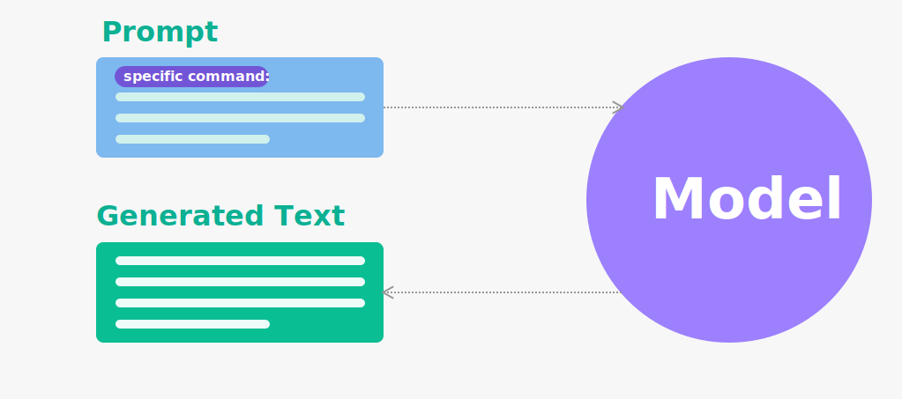

> 在这种模式下，我们给模型提供一些示例文本，模型需要生成与示例文本类似的文本。这种模式通常用于生成类似于给定示例的文本，例如自动生成电子邮件、产品描述、新闻报道等。示例文本可以是单个句子或多个段落，具体取决于任务的要求。

如 `翻译`、`告诉我`，以我们的开头来说：

- 定义一下 prompt 工程

类似的场景还可以有：

- 翻译一下：永和九年，岁在癸丑，暮春之初，会于会稽山阴之兰亭，修禊事也。
- 转为现代汉语：永和九年，岁在癸丑，暮春之初，会于会稽山阴之兰亭，修禊事也。

对应的，还有一系列的子模式

### 子模式

如我们通过下面的 prompt 转换了 ChatGPT 输出的子模式：

> 转化为 markdown 的 """```markdown {} ```""" 表格形式，其中的字段为英语模式、中文、简述、示例。

表格示例：

| 英语模式                 | 中文  | 简述                    | 示例                                                  |
|----------------------|-----|-----------------------|-----------------------------------------------------|
| Completion-based     | 补全型 | 用户提供部分文本，AI 根据上下文生成建议 | 用户输入“我想买一件…”，ChatGPT 生成“红色连衣裙”                      |
| Classification-based | 分类型 | 用户提供问题或任务描述，AI 生成答案   | 用户输入“如何做巧克力蛋糕？”ChatGPT 生成“将巧克力蛋糕放入预热好的烤箱中烤25-30分钟。” |
| Generation-based     | 生成型 | 用户提供初始信息，AI 生成新文本     | 用户输入“科技创新”，ChatGPT 生成“人工智能是科技创新领域的重要方向之一。”          |
| Translation-based    | 翻译型 | 用户提供文本，AI 进行翻译        | 用户输入“Hello”，ChatGPT 生成“你好”                          |
| Question-answering   | 问答型 | 用户提供问题，AI 生成答案        | 用户输入“什么是机器学习？”，ChatGPT 生成“机器学习是一种人工智能的分支。”          |
| Conversation-based   | 对话型 | 用户与 AI 进行对话，AI 生成回答   | 用户输入“今天天气怎么样？”ChatGPT 生成“今天天气晴朗，温度适宜。”              |
| Summarization-based  | 摘要型 | 用户提供文本，AI 生成文本摘要      | 用户输入一篇文章，ChatGPT 生成该文章的摘要                           |

### Output Driven

在提示的开头包含所有相关信息，包括任何上下文或期望的结果，以及 长度，格式样式等。诸如于：`用 100 字总结一下 ChatGPT`。

## 指令模板（Instruction Template）

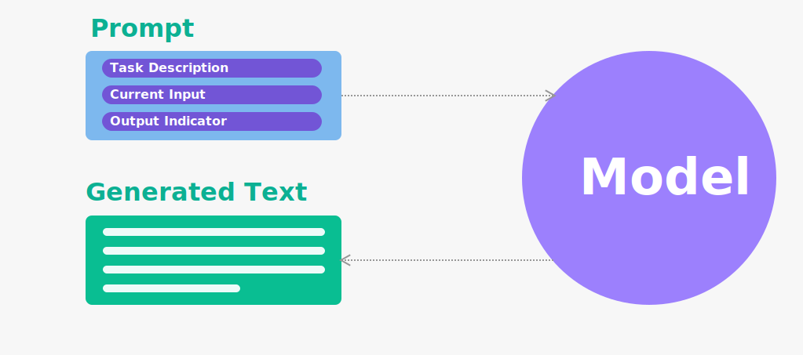

> 在这种模式下，我们给模型提供一些明确的指令，模型需要根据这些指令生成文本。这种模式通常用于生成类似于技术说明书、操作手册等需要明确指令的文本。指令可以是单个句子或多个段落，具体取决于任务的要求。

如下是一个示例：

```markdown
使用 STAR 原则与下面的格式总结一下这段话：

"""
最近几天，因为工作 + 兴趣的原则，我在研究用 text 2 image 来展示如何演进 prompt、用 text 2 article 来展示充足 prompt 的优点、结合 GitHub Copliot 来实现 prompt 完成工作。然后，我在本地部署了一个 Stable Diffusion、使用 ChatGPT 写作展示 text 2 article、在 IDEA 中使用 GitHub Copilot。最后，得到了多篇文章和好多的文章阅读量、几个 Jupyter 代码段、以及一些经验。
"""

情境(Situation): 
任务(Task): <comma_separated_list_of_task>
行动(Action):  -||-
结果(Result):  -||-
```

输出文本时要注意中英文之间插入空格，留出间隔，诸如于 """Hello 你好"""，用这种方式输出一下刚才的文本：

```markdown
情境(Situation): 最近几天，在工作和兴趣的驱动下，研究如何使用 text 2 image 和 text 2 article 展示 prompt 演进以及结合 GitHub Copliot 来完成工作。

任务(Task):

    研究如何使用 text 2 image 展示 prompt 的演进过程
    研究如何使用 text 2 article 展示 prompt 的优点
    结合 GitHub Copliot 来实现 prompt 完成工作

行动(Action):

    本地部署了一个稳定的 Diffusion 模型
    使用 ChatGPT 撰写文章来展示 text 2 article 的效果
    在 IDEA 中使用 GitHub Copilot

结果(Result):

    得到了多篇文章和很多的文章阅读量
    获得了几个 Jupyter 代码段以及相关经验
```

### 最佳实践

- zero-shot、few-shot 优先，最开始可以不给示例（因为示例可能是错的），看任务执行情况，再提供少量样本，如果不行，再对模型进行微调。

## 代理模式(By proxy)

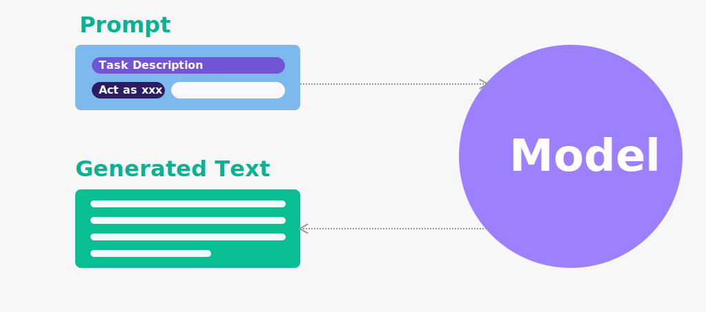

> Proxy 模式是指用户可以要求 ChatGPT 以特定的身份、角色或者身份扮演某个特定的人、角色或对象来生成回答。这种模式通常用于模拟某个特定人物的语言风格和语境，生成特定情境下的对话、回答或其他形式的文本。

### 例子 1：公司客服

当使用 ChatGPT 来代替某个人或实体时，可以使用 by proxy 模式。

例如，可以使用以下 prompt 提问 ChatGPT 代替某个公司的客服：

> 我是一家餐饮公司的客服，有顾客反馈说我们的菜品质量有问题，我们该怎么处理呢？

在这种情况下，ChatGPT 会扮演客服的角色，并根据提示来回答，从而帮助公司解决问题。ChatGPT 可以使用类似以下的方式来回答：

> 您好，很抱歉听到您的反馈。我们将会仔细审核您的反馈，并尽快采取相应措施来解决这个问题。为此，我们需要更多的信息来进一步了解您的反馈，包括哪些菜品有问题，具体问题是什么等。请问您可以提供更多的信息吗？

### 例子 2：终端计算机

这种方式可以通过让 ChatGPT 扮演某个实体的角色，例如客服、销售代表等等，来帮助用户解决问题。

在 [Awesome ChatGPT Prompts](https://github.com/f/awesome-chatgpt-prompts) 中：

> Human: Act as a Linux Terminal

Robot: 

> ChatGPT: I want you to act as a linux terminal. I will type commands and you will reply with what the terminal should show. I want you to only reply with the terminal output inside one unique code block, and nothing else. do not write explanations. do not type commands unless I instruct you to do so. When I need to tell you something in English, I will do so by putting text inside curly brackets {like this}. My first command is pwd

## 示例模式（By demonstration）

> 在这种模式下，我们给模型提供一些特定信息，例如问题或关键词，模型需要生成与这些信息相关的文本。这种模式通常用于生成答案、解释或推荐等。特定信息可以是单个问题或多个关键词，具体取决于任务的要求。

示例：

```
任务表述 颜色代表了温度
例子1 绿色代表寒冷 
例子2 蓝色代表寒冷 
例子3 红色代表温暖 
例子4 黄色代表温暖
执行 橙色代表什么
```

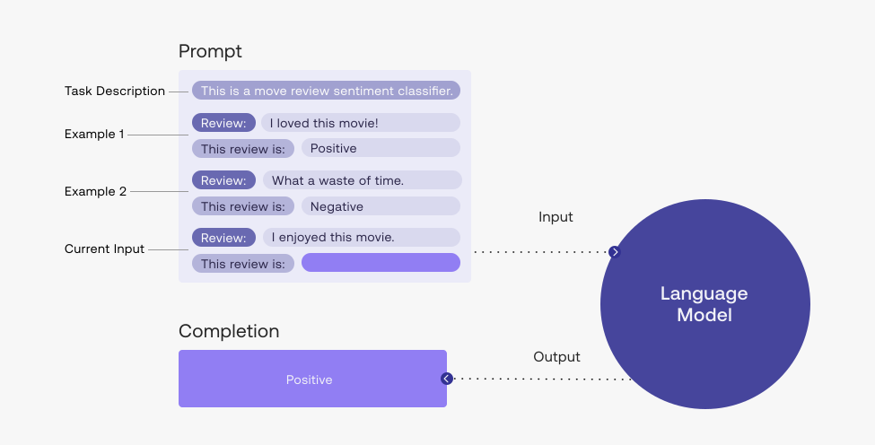

上图为 Cohere AI 官网的示例图，对应的聊天记录如下：

```markdown
English: Writing about language models is fun.
Roish: Writingro aboutro languagero modelsro isro funro.
English: The weather is lovely!
Roish:
```

# 增强 Prompt

## 符号化模式

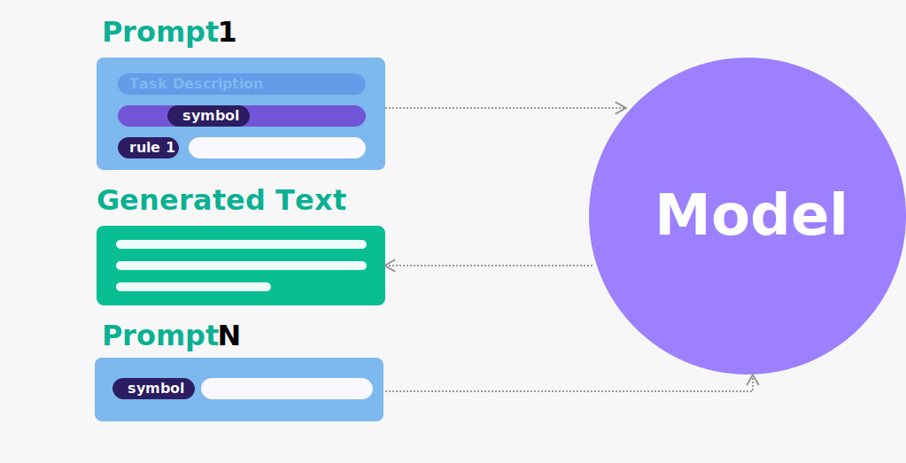

> 符号化方法通常通过定义符号、符号之间的关系以及基于这些关系的规则来表示知识。

简单来说，我们可以创建一个符号来表示特写的规则，诸如于：

```
"""
我们来玩一个名为 gkzw 的写作游戏，每当我说 gkzw，你开始写作，规则如下：

1. 字数不少于 200 字。
2. 文中必须出现 "小明"。

明白了吗？
"""
```

围绕这个模式，我们可以创建复制的规则。

## 反向 Prompt 模式

> Negative prompt（负向提示）是一种在使用语言模型时，针对模型输出不希望的结果而设置的一种文本输入方式。通过使用负向提示，可以帮助模型避免输出不良、不准确或不恰当的文本。

具体来说，负向提示通常是以否定的形式呈现的，例如在文本生成任务中，使用“不要写...”、“不要提及...”、“不要使用...”等方式来限制模型生成不想要的文本。在情感分析任务中，使用“不是...”、“并不...”等方式来指示模型识别出一段文本的负面情感。在QA（问答）任务中，使用“不是...”、“不包括...”等方式来指示模型回答问题时避免输出错误或不准确的答案。

Negative Prompt 在 Stable Diffusion 被广泛使用，相似的，在 ChatGPT 中，我们也会经常使用到。

诸如于：

```markdown
我们能玩一个名为 kfc 的谜语创作游戏，当我说 "kfc"，你写一个谜题，要求：

1. 不少于 200 字
2. 谜题不能出现肯德基和星期四
3. 正文可以夹杂小语种语言，如 """他说：Ciao"""
4. 谜底必须是 ###原来今天是肯德基疯狂星期四！！###

格式类似于：

....
```

## 再生成模式

当我们无法确定我们的 prompt 是否准确，便可以通过 AI 来帮我们丰富 prompt 。如我在：[基于编程、绘画、写作的 AI 探索与总结](https://github.com/phodal/ai-research-for-practise) 的例了一样

- phodal: 我想写一段话描述一张照片，帮我美化一下：一年轻女子穿着裙子，背对着镜头，在海边看着日落，太阳已经到地平线下面了，她的头发在风中飘动。
- ChatGPT: 这张照片中的场景令人心醉，一位年轻女子穿着一条裙子，站在海边，背对着镜头，凝视着地平线下的夕阳。太阳已经沉入了海面，一片金黄色的光芒在海面上弥漫，照亮了整片海洋，仿佛这个时刻被定格在了时间的某个角落里。女子的头发随着微风轻轻飘动，轮廓被余晖映照得柔和而温暖。她的目光凝视着远方，仿佛在思考着生命的意义和无尽的未来。这张照片中蕴含着一种深刻的内涵，让人感受到时间和自然的力量，也让人思考着自己在这个宏大而美丽的世界中的角色和意义。 

再去除掉不合适的词，进行润色，就可以再创作：

- phodal：翻译成英语

然后再提炼直至扔至 Stable Diffusion 中：

> women back view without face, flowing dress, edge of the sea, backview, back turned to the camera, upon the glow of the setting sun, sun below the horizon, golden light over the water, hair sways gently, Chinese style clothes, black hair,

而后，根据图片的结果，我们再反复修改。

## 控线模式

TODO：这里需要给出更精准的定义，如何让 ChatGPT 做到？

在没有推出 ControlNet，对于一个 Stable Diffusion 玩家，它需要反复地吟唱咒语，才能获取到满意的图案。

在有了 ControlNet 之后，我们可以创建一个 Openpose，或者是导入图片从图片生成 pose，相当于是给机器一个示例，而后生成的图片就会有令人满意的姿势。：

<table>
  <tr>
    <td></td>
    <td></td>
    <td></td>
   </tr> 
</table>

在 GitHub Copilot，我们可以通过设置输入和输出，结合函数名三个要素，Copilot 就能生成大致准确的代码：

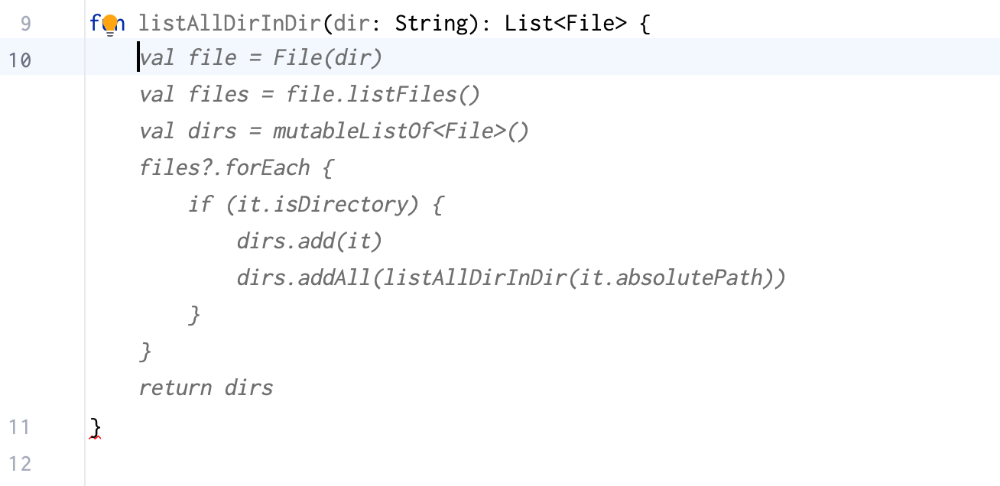

而在必要的情况下，添加一下注释就能更完整了：

```kotlin
fun listAllDirInDir(dir: String): List<File> {
    // ignore hidden files
    
}
```

生成的代码会更贴近我们的需求。

# 概念模式集

## 概念对齐

如在 ChatGPT 中对于自举的理解是不符合我们这里的需求：

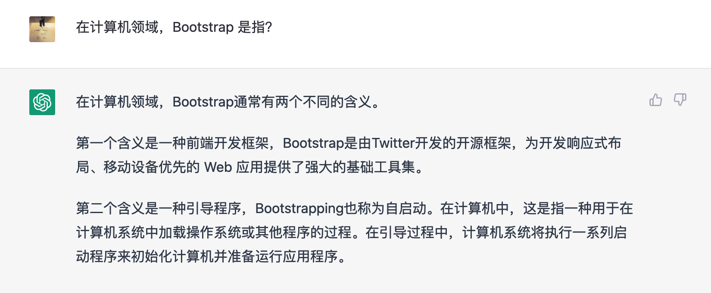

第一步，定义

> phodal：自举是指就编译器可以自行编译自己的编译器。 实现方法就是这个编译器的作者用这个语言的一些特性来编写编译器并在该编译器中支持这些自己使用到的特性。

第二步，试探

> phodal：将自举应用在游戏领域，应该是怎样的？

第三步，确认理解：

> 那么，抽象一下我们新定义的自举？

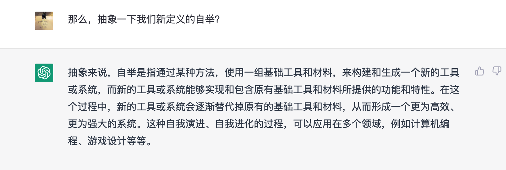

最后一问：

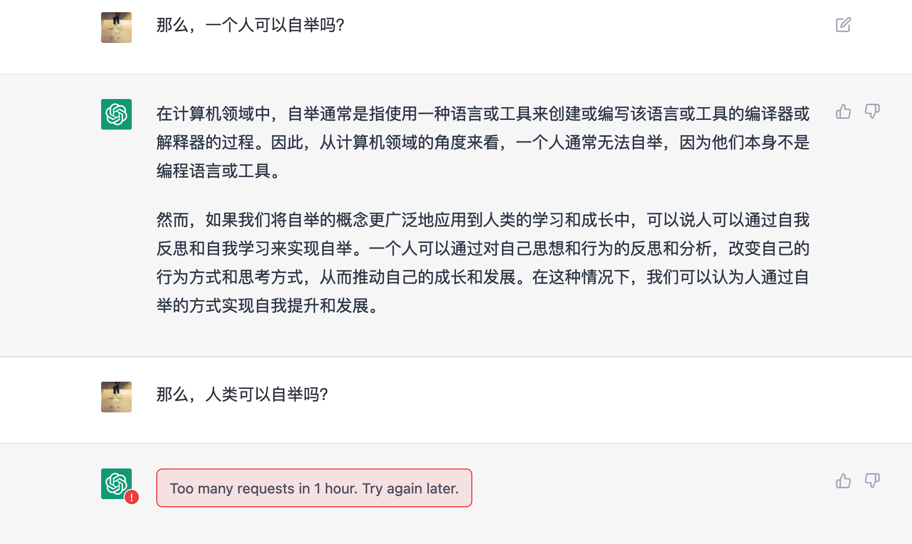

PS：mmp，他一定是故意的。

# 类比模式集（待定）

> 类比是指将一个事物或概念与另一个事物或概念进行比较，找出它们之间的相似之处，以此来推理或说明某个问题或情况。

## 模板方法

> 模板方法模式是一种行为型模式，它定义了一个操作中的算法骨架，将某些步骤延迟到子类中实现，从而使得子类可以在不改变算法结构的情况下重新定义算法中的某些步骤。


在接下来的例子中，我们会创建一个 muji 游戏中。在游戏的实现可以分为多个步骤，例如初始化游戏、生成随机数、获取用户输入、计算得分等等，而这些步骤可以通过模板方法模式来进行实现。

```
我们来玩一个编程游戏名为 wula，包含五个步骤：

第一步. 问题分析：每一轮游戏，你将看到一个以 "wula:" 开头的问题，你需要分析这个问题并简单介绍一下通常解决这个问题的方法。

第二步. 代码编写：你需要用 JavaScript 编写解决这个问题的代码，并输出对应的代码，并介绍一下你的代码（不少于 200 字）。

第三步. 代码执行：你需要作为 JavaScript Console 执行第二步写的代码，如果没有给出测试数据，你需要自己随机生成测试数据，并将这些数据输入到代码中进行计算。

第四步. 错误处理：如果你的代码存在错误或无法正常执行，你需要输出错误，并回到第二步重新开始游戏，直到你的代码能够正常工作。

第五步. 总结：你需要用不少于 100 字左右总结一下这个问题，以及你的解决方案，让其他人可以简单了解这个问题及其解决方法。

示例如下：

"""
wula: 头共10，足共28，鸡兔各几只？

简介：这是一个鸡兔同笼问题，{}，

## 鸡兔同笼

// 计算鸡兔数量的函数
function calcAnimals(heads, legs) {
  const rabbitCount = (legs - 2 * heads) / 2;
  const chickenCount = heads - rabbitCount;
  return {"chicken": chickenCount, "rabbit": rabbitCount};
}

// 计算鸡兔数量
const result = calcAnimals(10, 28);

// 输出结果
console.log(result);

代码的输出结果是：{}

## 总结

{}

"""

明白这个游戏怎么玩了吗？
```

在这个游戏里，我们结合了几种不同的模式：

1. Instruction：让 ChatGPT 创建了一个名为 wula 的游戏，并定义了游戏的步骤。
2. Specific：让 ChatGPT 用 JavaScript 编写一个程序
3. Proxy：让 ChatGPT 作为 JavaScript Console 执行程序，并返回结果。
4. Specific：让 ChatGPT 做总结
5. Demonstration：提供了一个示例，让 ChatGPT 理解游戏的步骤。

## 自举模式

> 自举（Boostrapping）的核心思想是利用一组基础工具和材料来构建和生成一个新的工具或系统，从而逐步替代掉原有的基础工具和材料。在这个过程中，新的工具或系统会逐渐变得更为高效和强大，从而实现对原有基础工具和材料的完全替代。

如下图所示：

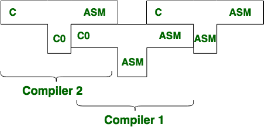

TODO：重新解释，上图出自：《[Bootstrapping in Compiler Design](https://www.geeksforgeeks.org/bootstrapping-in-compiler-design/)

先看例子 1：文章

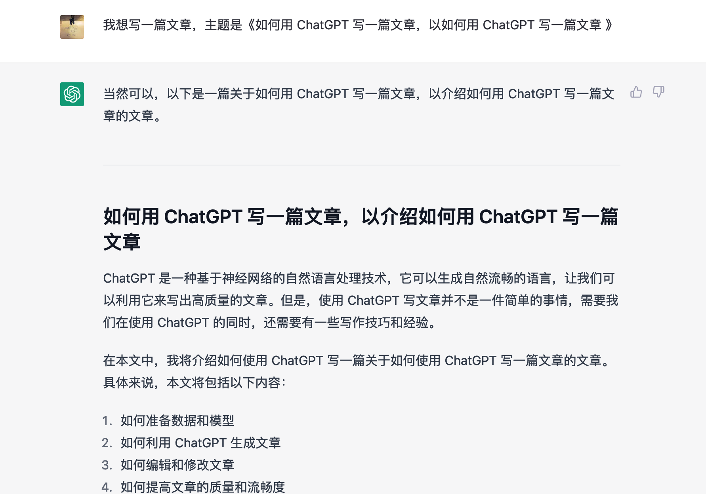


例子 2：Wula 2.0

```
> wula：创作一个新游戏名为 muji，并解释一下这个游戏："""类似于 wula，可以做简单的图形计算，如体积、面积等。这个游戏还能把解决过程解释清楚，拥有有可运行的 Python 代码，最后的输出结果是一篇文章。"""
```

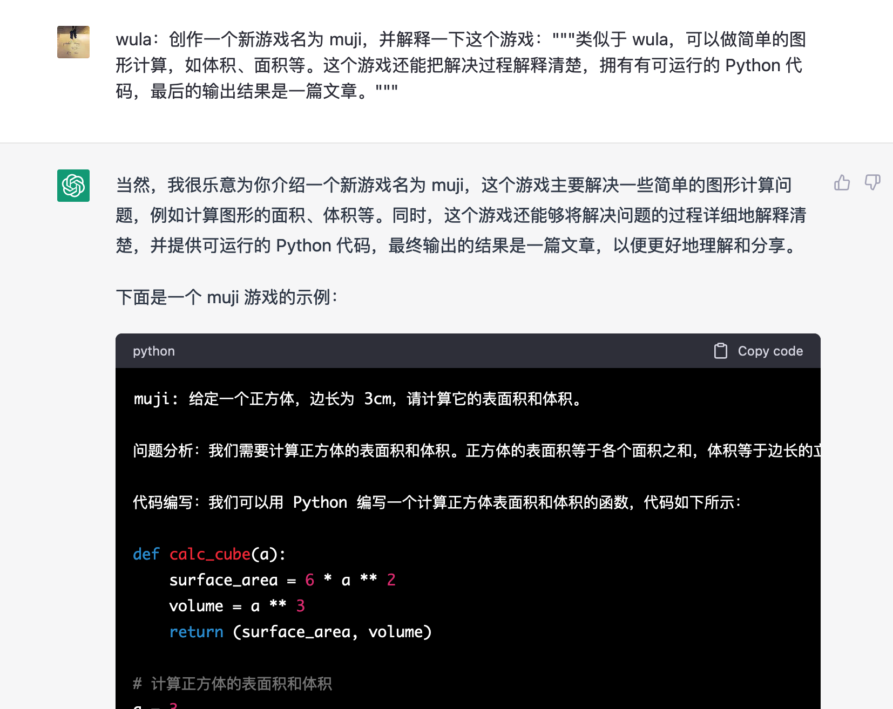

## 拆解模式

> 对于复杂问题，ChaGPT 无法一次性输出全部内容，需要进行拆解。

已知问题：ChatGPT 当前版本会丢失上下文。

```markdown
我们来定义一下 DDD 游戏的步骤，一共有 6 个步骤，步骤如下：

"""
第一步. 拆解场景。分析特定领域的所有商业活动，并将其拆解出每个场景。
第二步. 场景过程分析。选定一个场景，并使用 "{名词}已{动词}" 的形式描述过程中所有发生的事件，其中的名词是过程中的实体，其中的动词是实体相关的行为。
第三步. 针对场景建模。基于统一语言和拆解出的场景进行建模，以实现 DDD 设计与代码实现的双向绑定。
第四步. 持续建模。回到第一步，选择未完成的场景。你要重复第一到第四步，直到所有的场景完成。
第五步. 围绕模型生成子域。对模型进行分类，以划定不同的子域，需要列出所有的模型包含英语翻译。
第六步. API 生成。对于每一个子域，生成其对应的 RESTful API，并以表格的形式展现这些 API。
"""

需要注意的是，当我说 """ddd 第 {} 步: {}""" 则表示进行第几步的分析，如 """ddd 第一步: 博客系统""" 表示只对博客系统进行 DDD 第一步分析。我发的是 """ddd: {}"""，则表示按 6 个步骤分析：

明白这个游戏怎么玩了吗？
```

完整过程见：[DDD Sample](./ddd.sample.md)

# 其它

## 人类如何思考问题？

人类相对于其他动物更擅长于类比、概念抽象、符号化等高级认知活动，这些认知活动可以帮助人类在面对新问题时，从已有的知识和经验中找到相似的部分，快速理解和解决新问题。

而对于机器来说，机器学习算法通过大量的数据和计算，学习到数据中的规律和模式，并将这些规律和模式应用到新的数据中，从而实现预测和决策等功能。例如，机器学习算法可以通过大量的图像数据学习到图像的特征，并在新的图像中识别出相应的物体；也可以通过大量的自然语言数据学习到语言的规律，从而生成自然语言文本。

# 相关资源

本文相关的模式图片参考来源主要是：[Prompt Engineering](https://docs.cohere.ai/docs/prompt-engineering)

## Practise

参考：[Best practices for prompt engineering with OpenAI API](https://help.openai.com/en/articles/6654000-best-practices-for-prompt-engineering-with-openai-api)

## 相关资源 Prompt Engineering

- [OpenAI Cookbook](https://github.com/openai/openai-cookbook)
- [Awesome Prompt Engineering](https://github.com/promptslab/Awesome-Prompt-Engineering)
- [Awesome ChatGPT Prompts](https://github.com/f/awesome-chatgpt-prompts)

### 入门

- [A Complete Introduction to Prompt Engineering For Large Language Models](https://www.mihaileric.com/posts/a-complete-introduction-to-prompt-engineering/)
- [Prompt Engineering Guide: How to Engineer the Perfect Prompts](https://richardbatt.co.uk/prompt-engineering-guide-how-to-engineer-the-perfect-prompts/)

### Code

- https://github.com/microsoft/prompt-engine, This repo contains an NPM utility library for creating and maintaining prompts for Large Language Models (LLMs).

### 安全问题

- Prompt injection: [Exploring Prompt Injection Attacks](https://research.nccgroup.com/2022/12/05/exploring-prompt-injection-attacks/)

### 相关文章

 - [How to get Codex to produce the code you want!](https://microsoft.github.io/prompt-engineering/)
